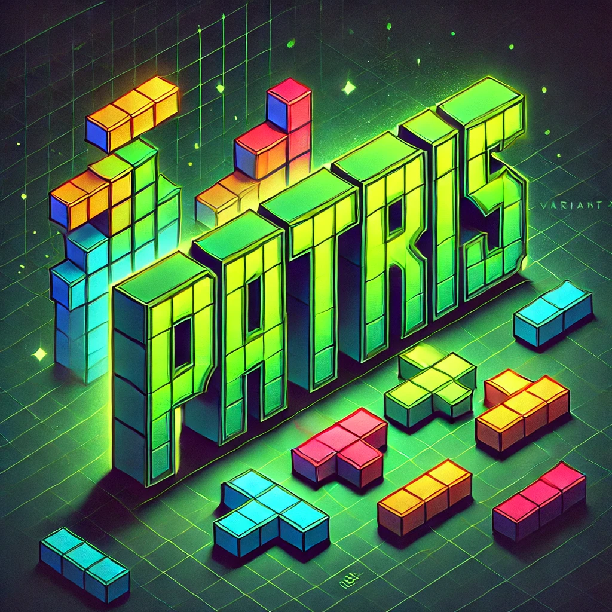

<p align="center">

</p>

# 🎮 PATRIS - PAsqal teTRIS


**PATRIS** is a variant of TETRIS that can be displayed on a PASQAL's QPU.
Indeed, the graphics engine of PATRIS is based on a [pulser](https://pulser.readthedocs.io/en/stable/)'s register, that is, an arrangement of atoms in the quantum processor.

## 🚀 Features

- **Trap-Based Visualization System**  
  Monitor 200 virtual "traps" (20x10 grid) representing game state (or quantum register)
- **Time Attack Mode**  
  Race against a decaying timer refreshed by line clears
- **Quantum Mode**
Activate the quantum mode and see if your classical computer can compute the PATRIS's quantum state !


## ⚙️ Installation

1. **Prerequisites**  
   Python 3.10+ and pip package manager

2. **Install from source**
```bash
git clone https://github.com/yourusername/patris.git
cd patris
pip install -r requirements.txt
```
## 🕹️ Usage
To get the classic mode:

```bash
python patris.py
```
to go quantum
```bash
python patris.py --quantum
```


## Controls

- ← → : Move piece horizontally
- ↑ : Rotate piece
-  ↓ : Soft drop

# Game Mechanics

- Start with 60-second timer
- Clear lines to gain +5 seconds each
- Score multiplier for consecutive clears
- Classic Tetris piece rotation logic